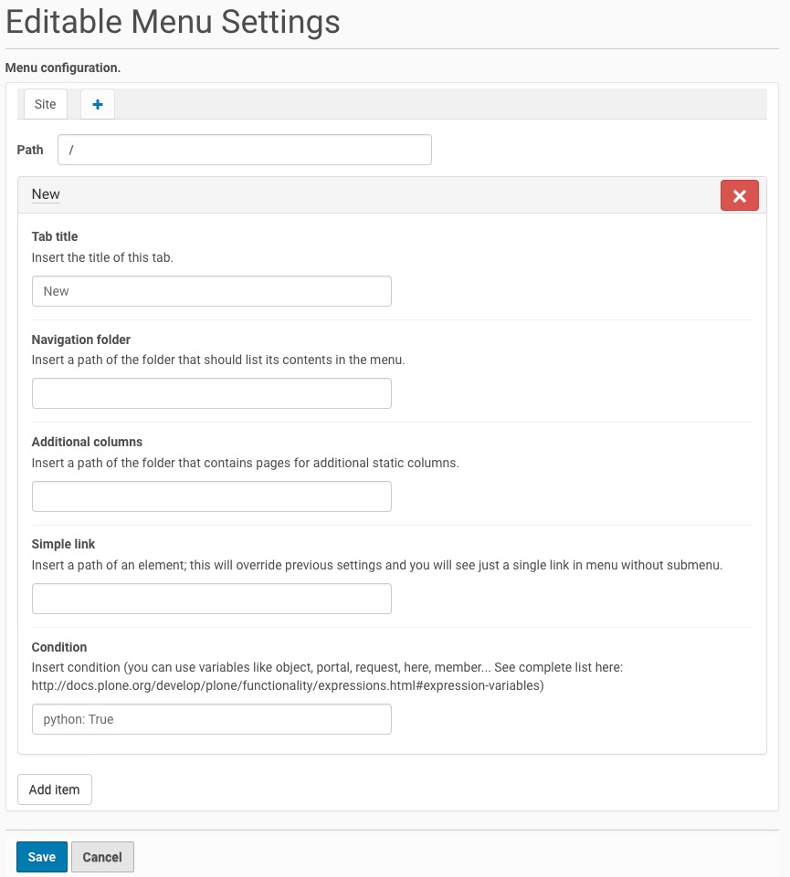
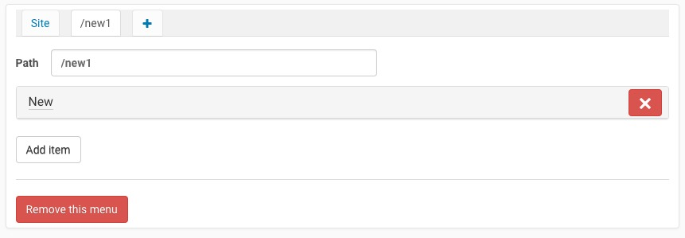

.. This README is meant for consumption by humans and pypi. Pypi can render rst files so please do not use Sphinx features.
   If you want to learn more about writing documentation, please check out: http://docs.plone.org/about/documentation_styleguide_addons.html
   This text does not appear on pypi or github. It is a comment.

==============================================================================
collective.editablemenu
==============================================================================

Customizable navigation menu for Plone. Features include:

- Manually defining entries for the navigation menu
- Setting conditions on single entries
- Generating a submenu automatically by reading the contents of a given folder
- Generating a submenu manually from static pages
- Both submenu types can exist for a single entry
- No opinionated styles for the menu. Give it your own style in your site theme.
- Handles multiple configurations, bound to different paths. Useful for handling subsites, for example.

Basic configuration
-------------------

This is how the control panel looks like:

Below the title you can find tabs. Each tab holds the configuration for a single path. We will go into detail about this later, for now we will work on the main tab, which has the name of the current Plone site.

The *path* field holds the root path of this configuration. Every path under this one will use this menu.

Following the *path* field there is a list of menu items (only one is shown in the picture). Each menu item is a collapsible, sortable (by dragging up and down) and removable fieldset of five fields.

*tab_title* is the title of the menu entry. It's the string that will be printed on the main navigation menu.

*Navigation folder* is the path of the folder from which we can automatically generate a submenu.

*Additional columns* is the path of a folder that contains pages. The text of the pages will be added in the generated submenu. This can be used in addition to the *Navigation folder* field, for example to add an image to the generated submenu, but can also be used alone, to generate a static customized submenu.

If we use one or both the previous fields, the main navigation link will toggle the collapsible submenu that was generated.

*Simple link* overrides the previous two fields and can be used to create a simple link to a specified url.

*Condition* is an expression that is verified to decide whether to show the menu entry. Defaults to *python: True* when creating new entries, can be changed to *python: False* to hide the entry, as a basic configuration, but more complex expressions are allowed. See a complete list here: http://docs.plone.org/develop/plone/functionality/expressions.html#expression-variables

After the entries list, you can find another button (*Add item*) that adds a new menu entry.

Adding multiple menus
---------------------

If you click the Plus icon on the tabs on top of the control panel, you can add an additional menu configuration. This is an example of what you will see just after clicking it:

A new tab has been created with a temporary title */new1*, this is not going to change unless you insert a proper path and save the changes. Upon loading the page, the widget looks for an object that has the specified path and uses the title of that object as the panel title.

The path has to be set to the path that you want the root of the new menu to be. For example, if you want a different menu to be used for a subsite, set the *path* field to the subsite root path.

A first menu entry is automatically created for you at this time, with teh default name "New". Click it to open it and start editing.

When you are editing a menu configuration different from the main site configuration, you will see an additional red button at the bottom of the screen, saying "Remove this menu". This removes the whole tab.

**BEWARE**: removing a menu means losing everything you wrote in it so far.

Nevertheless, keep in mind that no changes will be saved to the configuration of any menu, until you click the blue *Save* button at the botton of the control panel.

Events
------

Three different custom events will be fired from the menu links:

- `editablemenu.submenu.opened`: when the menu finishes sliding down
- `editablemenu.submenu.closed`: when the menu finishes sliding up
- `editablemenu.submenu.loaded`: when the menu finishes loading new content

Installation
------------

Install collective.editablemenu by adding it to your buildout::

   [buildout]

    ...

    eggs =
        collective.editablemenu

and then running "bin/buildout"

Compatibility
-------------

This add-on has been tested on Plone versions 5.0 and 5.1.

For Plone 4 compatibility, use version 0.10.2 (a dedicated branch is coming soon...)

Upgrading old versions
----------------------

From 2.1.0 version, we drop an old unused configuration that has been replaced since 2.0.0.
To do this, we needed to delete some unused code/interfaces.

If you have very old versions of this product (< 0.10.0) you should install 2.0.0 version and perform upgrade-steps, before installing the latest one.

Development
-----------

In this product there are several static resources:

- sass styles
- React app for the configuration menu
- Js for the rendered menu

To compile the widget configuration app:

Go to `src/collective/editablemenu/browser/static/js/widget` folder.

Then install dependencies:

    yarn

And finally compile React app:

    yarn build

After that, you need compile all the resources and bundle them for resource registries bundles:

Go in the project's root and install dependencies for Grunt:

    npm install

And finally compile and uglify the resources:

    npm run compile

Contribute
----------

- Issue Tracker: https://github.com/RedTurtle/collective.editablemenu/issues
- Source Code: https://github.com/RedTurtle/collective.editablemenu

License
-------

The project is licensed under the GPLv2.
